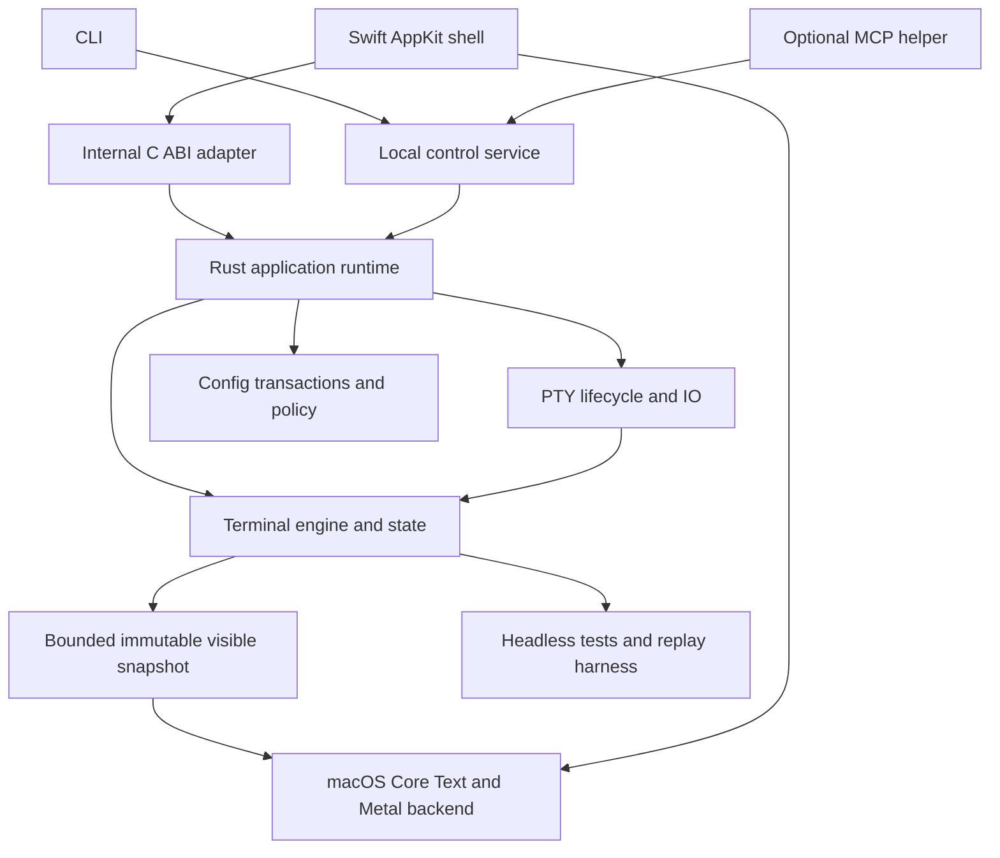
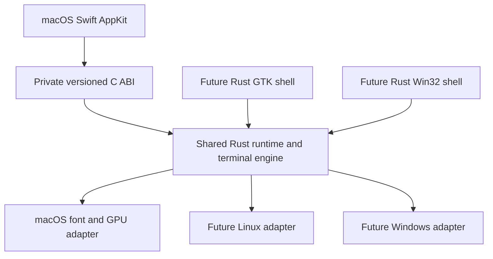
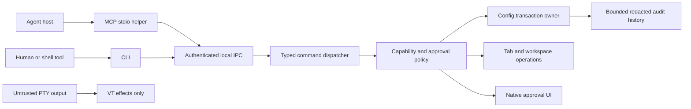

# Nebulax: Phase B architecture proposal

Date: 2026-09-25  
Technical review revision: 2026-09-26 (engine acceptance, config guarantees and experiment staging)  
Status: **historical proposal; revised direction approved 2026-09-26 in [ADR 0001](../docs/adr/0001-approved-direction.md)**. Experimental choices remain open; approval-gate wording below records the earlier review stage.  
Owner-selected product/CLI names: **Nebulax** / **`nebulaxterm`**. Project directory and intended GitHub repository name: `nebulax`. Proposed config slug: `nebulax`.

This is a design for an unimplemented product. No ADR is accepted and no benchmark has run. The [research record](EXTERNAL_RESEARCH.md) distinguishes inspected code from documentation and unresolved questions. The [toolchain policy](TOOLCHAIN_POLICY.md) incorporates the owner's requirement to begin with the newest stable releases. The [naming record](NAMING.md) documents the owner's Nebulax / `nebulaxterm` decision and earlier candidates.

## 1. Executive summary

Build a native macOS terminal first, with Rust owning terminal state, PTY coordination, configuration and control policy, and Swift owning AppKit windows, menus, tab integration, input composition and accessibility adapters. Use an internal C boundary only where Swift calls Rust. Rust consumers use Rust APIs directly. Prefer native Metal and Core Text for the first platform, subject to a comparison with wgpu and a text/FFI spike. No browser surface, embedded scripting language, or default session daemon.

The most consequential recommendation is **reuse-first terminal emulation**. Evaluate a thin integration of `alacritty_terminal` before owning a new grid and VT semantic engine. Compare it with `vte` plus a deliberately limited state prototype and with Ghostty's terminal behavior. A parser is not an emulator. Only build or fork substantial state machinery if a documented protocol, memory, licensing or integration gap warrants the continuing maintenance. Keep proposed custom cell layouts as experiments until this decision is settled.

Reuse acceptance requires more than a successful ASCII replay. P0-06 must cover the public-v1 protocol matrix, grapheme extension across input chunks, emoji/width and reflow behavior, selection/accessibility text extraction, and bounded history plus side allocations. Classify each requirement as supported, adapter work, upstream/fork work, or unresolved, with executable evidence for implemented behavior. The inspected [0.26.0 terminal configuration API](https://docs.rs/alacritty_terminal/0.26.0/alacritty_terminal/term/struct.Config.html) exposes scrolling history but no explicit history-byte-budget field; inference: our proposed `max_bytes` policy needs an integration proof, not an assumption that the setting maps directly. This API observation neither rejects the engine nor proves its resource behavior. A renderer cannot repair incorrect authoritative cursor or cell state by changing glyph appearance. Revisit the engine if meeting required behavior needs a second authoritative grid or an unbounded patch burden.

| Objective | Feasibility assessment | Release treatment |
|---|---|---|
| Idle memory at or below Alacritty | Unproven; native frameworks, tabs, font fallback and different scrollback policies can outweigh core savings | Optimization target, not a pre-baseline promise or sole release gate |
| Median input latency at or below Alacritty | Plausible; presentation scheduling and display refresh may dominate parser speed | Establish end-to-end baseline and tail-latency target in Phase 0 |
| Throughput at or above Alacritty | Plausible for selected workloads; cannot infer it from Rust or Metal | Gate representative workloads and responsiveness during floods |
| Native macOS quality | Feasible with sustained IME, accessibility and lifecycle work | Apple Silicon Tier 1; proposed minimum macOS 14; Intel deferred initially |
| Linux | Feasible after the core is proven; “native” varies by desktop | GTK4/libadwaita is the provisional shell; Wayland first-class, X11 tested when delivered |
| Windows | Feasible later; ConPTY lifecycle and native text/input need dedicated work | Rust/windows-rs; supported Windows 11 initially recommended, older API-compatible systems deferred |

Typed configuration/control is a product pillar. Design its transaction and authority boundaries now, but ship full MCP, layouts and durable mutation history in Phase 2. Phase 1 includes schema-backed loading, validation, basic CLI, tabs, modern protocols and measurements. The first public release follows Phase 2, so the agent-oriented identity is real at launch.

Keep the repository small: human documents are canonical, GitHub Issues own actionable tasks, plans retain implementation context, and ADRs preserve decisions. Begin after review with a real research runner and validation entry point, not empty production crates. Native accessibility and input correctness take precedence over marketing comparisons.

## 2. Challenged assumptions

| Starting assumption | Challenge | Proposed change |
|---|---|---|
| Beat Alacritty on memory, latency and throughput | Different features and workloads create trade-offs; no local baseline exists | Measure matched configurations; approve thresholds after Phase 0 |
| Reuse `vte` to avoid building terminal emulation | Its [README](https://github.com/alacritty/vte) explicitly separates parser actions from semantics | Evaluate complete state reuse before implementing terminal behavior |
| Custom compact cells plus reused full core | A reused engine already owns its cell layout and invariants | Treat custom storage as an alternative, not a second mandatory copy of the grid |
| Native GPU APIs are inherently cheaper | wgpu is a [native Rust library](https://docs.rs/wgpu/latest/wgpu/); relative overhead is unmeasured | Compare feature-restricted wgpu and direct Metal using identical content |
| One thin graphics abstraction can be fixed now | Only one backend is being built; platform resource lifetimes differ | Share terminal render intent and damage semantics; defer a universal GPU trait |
| Unicode width has one universally correct answer | Segmentation, font advances and terminal width policy are different | Version width/segmentation data and document compatibility policies |
| Disabled symbols/session/control can cost literally zero | Code/assets still occupy disk; static metadata may remain mapped | Require no helper, watcher, timer or expensive allocation before activation; report disk/resident/GPU costs separately |
| A protected CLI flag enforces approval | An agent with shell access can also pass that flag | Enforce dangerous actions in the application, with approval bound to the exact action |
| Owner-only socket authenticates an agent | Same-user processes can often access the same files/environment | State the same-user trust limitation; use scoped capabilities against accidental or delegated misuse |
| A session file restores processes | Metadata does not retain PTYs or process trees | Reopen shells only; defer a mux daemon and command re-execution |
| Windows 10 1809+ is a durable support promise | It is a ConPTY API floor, while Windows product support has changed | Choose supported Windows releases when Phase 5 begins; do not commit to obsolete support now |
| Three native stacks and every modern feature belong in the MVP | That scope is unsustainable for a small project | Separate macOS engineering MVP, agent control, public release, then platforms |
| Newest stable means floating dependencies | Builds become irreproducible and benchmark comparisons drift | Resolve current stable at start and pin exact toolchains/lockfiles; update deliberately |
| Space / spaceterm is unused | Existing terminal projects and a published crate use SpaceTerm | Owner subsequently selected Nebulax / `nebulaxterm`; distribution identifiers still need verification |

Windows evidence: [ConPTY API](https://learn.microsoft.com/en-us/windows/console/createpseudoconsole) and [Windows 10 lifecycle](https://learn.microsoft.com/en-us/lifecycle/products/windows-10-home-and-pro). Unicode evidence: [segmentation](https://unicode.org/reports/tr29/) and [East Asian Width](https://unicode.org/reports/tr11/). These changes are recommendations for review, not silently accepted scope reductions.

## 3. Architecture

### Component responsibilities



The diagram shows dependencies/responsibilities, not a requirement for a crate per box. The core has no AppKit, network, MCP, file-watching, CLI, or clipboard implementation dependency. It emits typed requests for platform effects. The runtime makes policy decisions; the shell executes approved native UI operations on the main thread.

### Runtime data flow

```mermaid
flowchart LR
    KEY[Key or IME commit] --> INPUT[AppKit input adapter]
    INPUT --> ENCODE[Mode-aware Rust input encoder]
    ENCODE --> WRITE[Bounded PTY write queue]
    WRITE --> CHILD[Shell and child processes]
    CHILD --> READ[PTY readiness and bounded reads]
    READ --> VT[Parse and update terminal state]
    VT --> DAMAGE[Damage generation]
    DAMAGE --> VIEW[Visible snapshot]
    VIEW --> SHAPE[Shape and rasterize changed runs]
    SHAPE --> GPU[Glyph instances and atlas]
    GPU --> PRESENT[Metal presentation]
    VT --> EFFECT[Untrusted title, cwd or clipboard request]
    EFFECT --> POLICY[Runtime validation and policy]
    POLICY --> NATIVE[Approved native effect]
```



Snapshot extraction must not hold a mutable terminal lock during font shaping, GPU submission or a native callback. Bound retained snapshots to the latest renderable state plus resources still in use by the GPU. Dropping obsolete *frames* is acceptable; dropping terminal bytes or protocol transitions is not.

### Platform boundary



Prefer Rust-owned macOS renderer/text resources through maintained Objective-C bindings where practical. Swift creates the view/layer and owns its UI lifecycle. Phase 0 must establish layer retain/release, thread affinity, drawable acquisition and teardown. If Swift Metal/Core Text code is substantially clearer with equivalent cost, keep that adapter in Swift; changing its implementation language need not move the domain model.

FFI uses opaque instance/surface/snapshot handles, fixed-width numbers, explicit pointer+length buffers, error codes, and matching allocation/free functions. No Rust `Vec`, `String`, trait object, Swift object layout or unwinding crosses the boundary. Handles have documented thread affinity and generation/lifetime checks. A C header generated with `cbindgen` is checked for drift. Frame transfer is batched, not one callback per cell. Callbacks enqueue work rather than reentering Rust with a lock held. Destroy cancels producers and drains callbacks before releasing the context. ABI version checks fail closed on mismatched components; public stable SDK compatibility is not promised in v1.

### Agent-control architecture



There is intentionally no edge from PTY output to the control dispatcher. OSC 0/2 can affect the program-provided title subject to precedence; OSC 7 can supply untrusted cwd metadata; neither changes authority or persistent configuration.

### IO, scheduling and ownership

Initial experiment: one shared readiness thread (`mio`/kqueue on macOS), with bounded per-session read/write work and a single state owner. Compare against a thread per PTY and a hybrid with parser workers. The recommendation is the shared reactor if it maintains interactive fairness at 1, 10 and 100 sessions. Tokio is an experiment challenger, not a default GUI dependency. The [mio API](https://docs.rs/mio/latest/mio/) provides portable readiness primitives; it does not solve all platform PTY differences.

Start a service turn with input/control work, then round-robin ready PTYs with byte/time budgets. Coalesce render notifications. Backpressure pauses reads so the OS PTY applies pressure; never allocate an unbounded output queue. A large paste is chunked, cancellable, and ordered with bracket delimiters. Resize updates terminal geometry and the PTY size in a defined sequence and tags snapshots with the resulting generation. Child exit, hangup, partial write, `EINTR`, `EAGAIN`, EOF and cancellation get explicit tests.

Spawn through an audited PTY library or minimal OS-specific launch path with `setsid`, controlling terminal setup, FD closure and child reaping. In a threaded GUI, do not run arbitrary Rust/Swift code after `fork` before `exec`; establish the safe launch strategy in the PTY spike. Windows may need dedicated pipe reader/writer threads: keep domain events shared, not Unix file-descriptor assumptions.

## 4. ADR candidates

All rows are **proposed**. “Preferred” means the recommendation to test or approve, not a completed decision. Accepted ADRs later use: title, status, date, context, options, decision, consequences, performance/security/compatibility implications, and sources.

| Candidate | Options / preferred decision | Rationale and trade-off | Main risk / confirmation |
|---|---|---|---|
| 0001 Core/platform boundary | Rust APIs internally; private C ABI only for Swift vs universal C API or UniFFI | Narrow language bridge, idiomatic Rust elsewhere; manual lifetime rules | FFI teardown and snapshot ownership spike |
| 0002 Languages/macOS UI | Rust domain + Swift AppKit vs all Rust AppKit, SwiftUI-only, C++ | Native UI/input APIs with limited Swift; two toolchains | Main-thread correctness, bridge build cost |
| 0003 Initial platforms | Apple Silicon/macOS 14+ vs Universal initial binary | Smaller tested matrix; Intel users wait | Owner decision; revisit SDK/OS support at release |
| 0004 Rendering | Direct Metal first vs wgpu first vs three fixed native backends | Native candidate suits macOS; wgpu can reduce later maintenance | Matched renderer/memory/latency spike; no universal abstraction yet |
| 0005 Text | Core Text/Core Graphics on macOS; native later stacks vs shared Rust shaping | Native fallback and text quality; behavior varies by OS | Emoji, grapheme/run mapping and cache growth |
| 0006 VT strategy | Evaluate `alacritty_terminal`; compare `vte`+owned state, fork, Ghostty reuse | Minimize correctness burden; existing core constrains storage | Protocol/gap/performance scorecard; final choice after Phase 0 |
| 0007 Config | TOML + Rust types + JSON Schema vs JSON/JSONC/KDL/YAML | Typed user-editable config with comments; editing requires syntax tree | Round-trip, migrations, semantic/schema parity |
| 0008 IPC | Local UDS / Windows pipe with peer checks and scoped capabilities vs HTTP or output escapes | Narrow local interface, no network listener | Same-user threats remain; lifecycle/auth tests |
| 0009 MCP | Separate on-demand stdio helper vs in-GUI or daemon | No running MCP subsystem while unused | Latest SDK/client interoperability; helper startup cost |
| 0010 Linux shell | GTK4/libadwaita preferred vs direct Wayland/X11 | Reuse input/accessibility/windowing; GTK footprint and GNOME styling | Reevaluate current stable toolkit/X11 situation at Phase 4 |
| 0011 Windows shell | Rust/windows-rs, Win32, DirectWrite; native GPU candidate vs C++ or C# | Rust already reaches required APIs; no established need for another core language | Windows UX/accessibility and GPU choice need native testing |
| 0012 IO | Shared reactor preferred vs per-PTY threads vs hybrid/Tokio | Bounded thread count and scheduling control | Head-of-line blocking; choose using latency under flood |
| 0013 Sessions | Metadata restore, default ask; no daemon vs live-process keeper | Lower idle cost and smaller privilege surface | Make process loss explicit; never silently rerun commands |
| 0014 Development model | Canonical human docs, Issues, small plans and worktrees vs duplicated agent boards | Durable context with one task owner | Drift checks and reviewed generated artifacts |

[cbindgen](https://github.com/mozilla/cbindgen) produces headers; [UniFFI](https://mozilla.github.io/uniffi-rs/latest/) reduces binding boilerplate but introduces generated marshalling/API conventions. Prefer cbindgen for batched performance-sensitive exchange; do not export Swift-facing raw pointers without an ownership contract.

C# remains technically possible. We have no measurement proving .NET is too large; the reason to defer it is that Win32/DirectWrite are accessible through Rust and a second managed stack has no demonstrated benefit for this product. C++ is similarly unnecessary unless a specific vendor API or profiling result justifies it.

## 5. Core data structures

### Candidate storage, conditional on owning the grid

If complete engine reuse wins, retain its authoritative storage initially. Do not mirror the full grid into a custom one. A visible render snapshot may have its own packed format, but its bounded allocation must be counted.

The owned-grid baseline is a deliberately simple **16-byte candidate cell**:

| Field | Bytes | Meaning |
|---|---:|---|
| `payload: u32` | 4 | Unicode scalar or index, distinguished by a flag |
| `style_id: u32` | 4 | Index into a reclaimable style arena |
| `extra_id: u32` | 4 | Zero means absent; sparse extra record for grapheme and/or hyperlink |
| `flags: u16` | 2 | Continuation, protection and other cell metadata |
| `width: u8` | 1 | Lead cell width 1/2; continuation 0 |
| `reserved: u8` | 1 | Explicitly initialized padding/reserved space |

This is a proposed internal representation, not a stable serialized/FFI layout. Confirm `size_of`/alignment and real working-set behavior before accepting it. Compare an 8-byte page-local representation (`u32` payload, `u16` style index, two flag/width bytes, sparse side storage) and a simpler direct-style cell. Compactness can lose to hashing, overflow handling, and cache misses.

Style choices: direct style is straightforward and avoids lookups but increases every cell; global interning shares values but needs reclaiming and can be attacked with unique truecolors; per-cell reference counting adds mutation work; page-local dictionaries bound reclamation but complicate row movement. Preferred experiment uses generational style IDs plus per-page usage accounting, compared with direct style. On dictionary exhaustion, grow within a cap or switch that page's representation; never wrap an index or silently lose style correctness. Preserve fg/bg/underline color, underline style, attributes and default-color semantics.

Rows have stable logical IDs, wrap flags, dirty generation and storage offsets. Use a lazily allocated chunked row ring (e.g. 64-row chunks as a starting experiment). Keep scrollback as capped chunks, tracking both row count and total bytes including side data. Allocate the alternate screen only when first used. Reflow changes soft-wrapped logical lines; hard line breaks, cursor/saved positions, selection anchors, wide-cell pairs and hyperlinks remain consistent. Incremental/cancellable reflow is a later optimization if synchronous work blocks interaction.

Graphemes retain original text in a sparse arena. A combining sequence arriving in a later PTY chunk may extend the preceding cluster; width changes must repair continuation cells and wrapping. Define bounded pathological-cluster handling, replacing or terminating an oversized sequence deterministically without corrupting subsequent input. The cap is a documented resource/security policy, not a claim of unrestricted Unicode conformance. Hyperlink strings are interned with byte/count caps and reclaimed when no retained row references them. A reused engine's actual limits must be audited.

Ghostty's inspected [page source](https://raw.githubusercontent.com/ghostty-org/ghostty/main/src/terminal/page.zig) provides evidence for page-local uncommon data; Alacritty's [cell source](https://raw.githubusercontent.com/alacritty/alacritty/master/alacritty_terminal/src/term/cell.rs) provides a contrasting rare-extra allocation approach. Neither source proves the proposed layout's performance.

### Font and glyph model

The core determines cells, logical text and styling. The platform text adapter shapes bounded runs and maps glyph clusters back to cell spans. Never use proportional font advance to redefine terminal cursor positions. Font cache keys include face identity, size, scale, variation axes, feature set, glyph ID, raster mode and relevant rendering parameters. Fallback is chosen for a cluster where possible; arbitrary per-codepoint fallback can break emoji/combining sequences.

Use grayscale mask and color glyph atlas pages, allocated on demand and shared across tabs in the same renderer/device/font environment. Keep independently bounded shape, glyph and fallback caches. Atlas eviction respects in-flight GPU resources; use generations so stale coordinates cannot display another glyph. Device loss, screen-scale changes and font changes invalidate the correct layers. Font fallback does not require scanning every installed font at startup.

### Rendering model

Batch background rectangles, glyph instances, decorations, cursor and selection into a small number of draws. Begin with row damage and a complete visible-frame draw; distinguish reduced CPU work/uploads from partial presentation. A newly acquired drawable does not promise prior contents. Test retained backing or full redraw before any rectangular scissor optimization; select a full-frame threshold from measurements, not a guessed constant.

Use event-driven scheduling while static. Coalesce output up to the next presentation opportunity; prioritize input-triggered invalidation without scheduling a render for every byte. A bounded synchronized-output interval prevents a broken application from freezing display indefinitely. Vsync remains the default; measure presentation deadlines and missed frames before exposing low-latency alternatives. Suspend cursor blink/display timers when not visible. A blinking cursor means periodic work: the static idle benchmark must disable it and report the ordinary default separately.

Hidden tabs keep PTY/state active but produce no frames, and can release per-surface transient GPU buffers. A visible but unfocused window still needs output rendering. Shared atlas eviction must not thrash when switching between fonts/tabs. GPU completion governs recycling; main-thread AppKit work never waits synchronously for a flooded PTY or long GPU job.

## 6. Memory budget

All values below are **estimates of logical allocations**, using MiB = 1,048,576 bytes. They are not measured footprint or acceptance thresholds. Native frameworks, allocators, texture backing and shared memory make naive summation into a process footprint misleading.

Reference scenario: 120 columns × 40 rows; candidate 16-byte cell; no scrollback populated initially; alternate screen lazy; one font at a fixed recorded scale; first mask atlas 1024² at one byte/pixel; optional first color atlas 1024² at four bytes/pixel; illustrative drawable 1600×1000 physical pixels, BGRA8, up to three buffers. Font/grid pixel dimensions must be matched in actual measurements.

| Component | Sizing model / illustrative allocation | Ownership and control |
|---|---|---|
| Executable code pages | Build-dependent; measure resident shared/private pages and stripped disk size separately | Shared per process; no defensible numeric estimate before linkage |
| Rust libraries/allocator | No GC heap baseline; allocator metadata, retained arenas, stacks and linked code remain | Measure active vs retained allocation; “Rust” does not imply zero runtime memory |
| AppKit/Core Text/Metal frameworks | Unknown fixed and lazy costs; physical shared-page attribution is OS-dependent | First-window native-shell baseline isolates them |
| Primary grid | 4,800 × 16 = 76,800 bytes, **0.073 MiB** | Per surface |
| Alternate screen | Another **0.073 MiB**, after first activation | Per surface; lifetime policy measured |
| Row metadata | 40 × estimated 32 bytes ≈ **1.25 KiB** per visible grid | Per surface, plus chunk slack |
| Populated scrollback | 10,000 × 120 × 16 = **18.31 MiB**, plus ≈0.305 MiB row metadata | Illustrative cap, not preallocation; actual byte cap includes extras |
| Styles | Assumed 256 live records × estimated 32 bytes ≈ **8 KiB**, plus table overhead | Intern/page arena; high-entropy styles need separate workload |
| Hyperlinks/graphemes | Zero side records for plain ASCII; workload-dependent arenas | Byte/count caps; never assume negligible under hostile output |
| PTY buffers | Candidate 64 KiB read + 64 KiB pending write = **0.125 MiB** per active surface | Backpressure; sizes selected in spike |
| Parser state | Estimated **1–16 KiB** excluding separately capped OSC/DCS accumulators | Selected engine determines actual size |
| Runtime/tab metadata | Estimated **8–64 KiB** before strings/native UI objects | Per tab; IDs, cursor/modes, channels, selection state |
| Visible snapshots | One/two cell-equivalent copies ≈ **0.073–0.146 MiB** plus changed-run text | Only visible surfaces; actual snapshot format measured |
| Glyph mask atlas | 1024² R8 = **1 MiB** per initial page | Shared device/cache; includes only texture payload |
| Color atlas | 1024² RGBA8 = **4 MiB** when needed | Lazy; color/emoji workload |
| Glyph/font/fallback objects | Unknown native objects plus our capped cache entries | Count objects and incremental footprint as font diversity increases |
| Instance buffers | Assumed 32 bytes × 4,800 × 3 = **0.439 MiB** | Per visible surface; avoid retaining full capacity in every hidden tab |
| Drawables | 1600 × 1000 × 4 × 3 = **18.31 MiB** | Logical compositor/GPU backing; ownership/physical residency varies |
| Configuration/schema | Effective config proportional to chosen fields; do not load schema into GUI merely for display | Small typed state; schemas served by CLI/helper as needed |
| IPC | No socket/reactor registration until enabled; bounded active clients/messages | Must cap queue bytes, not only request count |
| MCP | No running process when unused | Measure whole separate helper plus transport buffers when enabled |
| Sessions/workspaces | No snapshots/history IO before enabled or explicit action | Metadata proportional to tabs; optional disk state separately capped |
| Symbols-only font | No font registration/raster cache before first qualifying glyph | Shipped file still has disk cost; measure mmap/residency after activation |

Let `B` be measured process/library/native-framework baseline, `F` font/cache residency, `N` native window/tab objects, and `S` populated scrollback+extras. Candidate ordinary per-tab CPU allocations above total roughly **0.21–0.42 MiB before chunk slack, OS objects, stacks and uncommon data**. This arithmetic is a sizing hypothesis, not a promise about an existing terminal engine.

* First window: `B + F + N + tab allocations + visible snapshot + S`; GPU logical payload starts near 19.75 MiB for the illustrative mask/instances/drawables, plus color atlas when needed. Physical CPU/GPU totals must not double-count unified memory.
* Additional tab in the same native group: new state, native tab objects and `S`; reuse fonts/device where compatible. Background hidden tabs should not each reserve drawables or a private atlas.
* Background visible window: its own visible snapshots/drawables; sharing font caches cannot eliminate presentation memory.
* Hidden tab: keep core state/PTY/scrollback, release dispensable surface resources; it is not equivalent to a suspended shell.
* Optional features: record the difference immediately before activation, after use, and after release/idle. A daemon or MCP helper belongs in the total process-tree report when enabled.

Use lazy allocation and runtime switches before proliferating Cargo features. Separate the MCP binary; consider compile-time features for experimental backends/tracing and genuinely optional linked libraries. Cold scrollback compression and disk backing are deferred because they introduce latency, privacy, and complexity; bounded uncompressed storage comes first.

## 7. Performance plan

Execute the complete protocol in [Phase 0](PHASE_0_PLAN.md). Pin exact competitor release artifacts and configuration hashes. Use the same host, display, refresh, scale, font, font size, locale, shell, prompt, grid and scrollback limits. Keep the benchmark shell separate from the interactive development environment. Compare official release binaries first; label source builds independently.

For each sample store commit/dirty state, version, OS/build, CPU/GPU/RAM/architecture, toolchain, display resolution/refresh, physical window and grid size, font file/version, shell/version, complete config hash, tool/version, command, workload hash, run order, warmup, elapsed time and raw data. Record sleep/power/thermal state and invalid-run reasons. Never discard slow samples without a predeclared external-failure rule.

Measure first-window footprint and the slope at 1/2/5/10 tabs; use separate-window Alacritty results as a labeled comparison rather than pretending it offers tabs. On macOS use `footprint`/`vmmap` supported by that OS and Metal Instruments for attributable GPU allocation; Linux uses PSS; Windows uses private working set/commit. Report shell/helper processes separately and as a total, retaining raw tool output because fields differ across versions.

Measure key-to-photon with a camera/input timing marker on the same display, reporting at least median/p95/p99 and instrument resolution. Typometer is an optional instrument only if validated on the tested platform; synthetic key dispatch is not physical input timing. Measure internal event-to-present as a separate diagnostic. Throughput uses [vtebench](https://github.com/alacritty/vtebench) plus fixed replay corpora and an acknowledged completion condition; shell return alone does not prove parsing or presentation completion.

Parser-only, state-only and rendered replay results are separate. Profile ASCII, mixed UTF-8, cursor movement, styles, long OSC, combining/ZWJ, and scroll/reflow. Optimize ASCII run batching and allocation after correctness; do not begin with hand-written SIMD. Stable CPU microbenchmarks need enough repetitions and checksums to prevent optimized-away work.

There is no universal score. Report median/p95/p99, variance and confidence intervals where sample size permits, plus memory peaks and steady state. Stable hardware runs can gate regressions after noise characterization; shared CI runs only benchmark smoke/semantic checks. Phase 0 ends with an owner-reviewed threshold table for each important workload and an explicit memory/feature trade-off.

## 8. Configuration specification

### Files and canonical model

Proposed config root: `$XDG_CONFIG_HOME/nebulax` or `~/.config/nebulax` on macOS/Linux; `%APPDATA%/Nebulax` on Windows. Choose one documented default per OS, not competing native/XDG sources that load accidentally. macOS state/history lives in `~/Library/Application Support/Nebulax`, Linux state in `$XDG_STATE_HOME/nebulax`, Windows state under the application's local-data directory. Runtime sockets are ephemeral and separate from both.

```text
config.toml             # primary user-owned document
keybinds.toml           # loaded only through an explicit include
themes/*.toml           # color-only theme model
profiles/*.toml         # named overrides with protected fields identified
layouts/*.toml          # structural documents, not implicit config sources
AGENTS.md               # optional generated guidance, linked to schema/CLI docs
```

Config structs are the canonical *type model*: `serde` deserialization + `schemars` schema, shared semantic validation, field metadata for hot-reload class, sensitivity, permission tier, defaults and documentation. Separate partial file/layer structs from resolved runtime structs so omitted values do not overwrite earlier layers with defaults. Generate a versioned JSON Schema using an explicitly selected draft (2020-12 initially), CLI field help and website reference. Test the TOML-to-JSON projection and semantic validator; schema cannot encode every cross-field or filesystem rule.

TOML wins provisionally for comments, familiar tables and Rust tooling. JSON has excellent machine/schema support but no standard comments; JSONC adds parser/tool choices; KDL is readable but brings another document/editing ecosystem; YAML's additional syntax/type/alias behavior is unnecessary here. Use the latest stable TOML tooling, record its supported TOML spec, and avoid schema-representation ambiguity: no config datetimes, non-finite floats or integers outside the portable machine-output range.

### Deterministic composition

Order, from low to high: built-in defaults → recursively loaded includes in listed order → including/root document → selected profile → explicit launch overrides → per-surface overrides. Theme resolution fills only the palette namespace before explicit palette overrides; it cannot inject commands, include other files or alter security settings.

Tables merge by key; scalar values and arrays replace. Keybindings use named IDs in a table rather than implicitly merging arrays. `unset` removes a value from the selected editable layer and reveals the inherited value; it does not mean JSON null. Explain the resulting effective value and its source in dry runs. No implicit current-directory config, automatic environment-variable overrides, command substitution, network includes or glob expansion.

Includes resolve relative to their including file. Canonicalize existing paths, track file identities for cycles/duplicate detection, and bound depth, file count and aggregate bytes (initial test limits: 16 levels, 32 files, 1 MiB). Missing includes are errors unless an explicitly modeled optional include is used. Treat symlink targets consistently with the approved config-root policy. Expand `~` only in schema-declared paths; optional `${VAR}` expansion uses an explicit allowlist and fails for missing variables. Do not expand arbitrary strings or commands. Preserve original source text and provenance separately from expanded values.

Example proposed config, not an implemented schema:

```toml
schema_version = 1
include = ["keybinds.toml"]
theme = "catppuccin-mocha"

[font]
family = "JetBrains Mono"
size = 14.0
ligatures = true
symbols = "builtin"
symbol_width = 1

[cursor]
shape = "bar"
blink = false

[scrollback]
max_lines = 10000
max_bytes = 33554432

[session]
restore = "ask"
save_scrollback = false

[control]
enabled = false

[security.clipboard]
osc52_read = "deny"
osc52_write = "ask"
```

The font and theme names express user intent; validate availability and report fallback instead of silently claiming the requested resource loaded. Numeric scrollback limits above illustrate a bounded config, not an approved performance budget.

### CLI contract

| Command family | Behavior |
|---|---|
| `config get [path] --json` | Effective values with generation/source; sensitive fields redacted unless separately authorized |
| `config set PATH --value-json VALUE` | Typed scalar/object value; example `config set font.size --value-json 14` |
| `config unset PATH` | Remove only from selected writable layer; preview inherited result |
| `config validate [file]` | Syntax, types, cross-field semantics and authority classification; no writes |
| `config diff [file]` | Show proposed effective/source changes and restart/new-tab requirements |
| `config apply FILE --dry-run` | Resolve and validate complete candidate; return revision and approval requirements |
| `config apply FILE --if-revision HASH` | Commit only if source revisions match; no last-writer-wins race |
| `config history --json` | Bounded revisions and actual transport/source metadata |
| `config rollback REVISION` | New transaction restoring values; current validation/approval still applies |
| `config schema` / `config docs` | Versioned machine schema / generated human field reference |
| `config migrate --dry-run` | Explicit migration plan with backup, source version and semantic diff |

All mutating commands support dry-run and structured output; avoid ambiguous shell parsing by taking JSON values or a patch file. Define stable exit codes for validation, conflict, denied/approval-required, unavailable instance and internal failures. JSON errors include a machine code, field path, safe current value, expected type, allowed values, reason and suggested fix. Secret fields return redaction markers, not their contents.

### Mutation, history and hot reload

One logical transaction implementation serves GUI, CLI and MCP. While a GUI instance is running, route mutations to the designated config writer; do not run multiple competing file writers. Offline CLI uses the same library and a per-config-root lock. Use revision hashes over relevant raw inputs, not mtime alone. Cooperating writers get serialized revision checks and commits. External editors remain possible: recheck source revisions before replace and return detected conflicts, but do not promise complete exclusion of edits made between that check and replacement. Atomic rename is not a content-hash compare-and-swap. P0-10 must test that race, recovery copies and conflict reporting; a stronger no-lost-edit guarantee requires a proven coordination or storage design. Review evidence: the installed macOS `rename(2)` manual describes replacement, swap and exclusive-create semantics, not replacement conditional on the old content hash.

Transaction stages: parse preserving syntax → resolve layers → validate → classify protected/hot-reload changes → obtain required approval → preflight platform resources → write candidate and recovery metadata to same-filesystem temporary files → flush → atomic replace → publish a new runtime generation. Exact crash-recovery semantics must be tested; one rename does not atomically commit a directory of files. Initially mutate one owned document per transaction. Do not rewrite an included file implicitly.

Stage font/theme/resource changes before publishing; reject if a required resource cannot be prepared. Use immutable config snapshots. Existing sessions retain settings classified “new session only”; expose active vs desired values. A valid but restart-only value must not be represented as already active. Multiple application processes report their own applied generations; a disk commit is not a claim of atomic simultaneous application everywhere.

Watch parent directories as well as files to tolerate editor atomic replacement; debounce and hash to avoid loops. Invalid reload preserves the last-known-good state and shows a nonintrusive error. A rejected protected candidate remains pending; it cannot gain approval merely by restarting. Journal recovery distinguishes a prepared change from a committed generation. After crash, load a verified committed revision and report discrepancies.

Keep the approved protected baseline separate from user-editable candidate TOML. First import of custom protected values requires native review before those values take effect. A missing, corrupt or mismatched approval record cannot approve the current file automatically; offer safe built-in behavior or recovery through native review. An unchanged approved profile should not prompt every launch. Bind the effective protected values and their dependencies (including profile/include content and relevant expanded variables) to the approval, and revalidate at use. Do not allow an offline CLI to mint approval or apply new protected execution settings merely because no GUI is running. P0-10 proves this startup/restart state machine before Phase 1 loads custom protected settings. This is an application policy boundary, not tamper-proof protection against unrestricted same-user software.

History stores timestamp, revision chain, input source (`user-editor`, `cli`, `mcp`, `migration`, `system`), changed keys and bounded redacted diffs. Transport source is not proof of human/agent identity. Full snapshots can contain secrets; store user-only with bounded retention, exclude credentials where possible, and explain when a protected field cannot be automatically rolled back. Rollback is revalidated against today's schema/policy. Migrations are explicit, version-by-version, backed up and never execute commands; reject unknown future schema versions.

## 9. Agent control specification

### IPC transport and discovery

macOS/Linux: Unix-domain socket under a verified user-owned runtime directory (0700 parent, 0600 socket). Linux prefers a validated `XDG_RUNTIME_DIR`; macOS uses the OS-provided per-user temporary location with a private application subdirectory. Avoid a predictable globally writable socket path. Verify parent ownership/mode and prevent symlink substitution. Use peer credentials (`getpeereid`/appropriate Linux credentials) plus capability authentication; server and client validate instance ownership.

Windows: named pipe with an explicit user/logon-session ACL and remote-client rejection; validate the peer token rather than trusting a supplied username. PID metadata helps discovery but is not authentication. Manifests contain an opaque instance ID, endpoint, protocol range and creation nonce, written atomically with owner-only permissions. Handle stale sockets and PID reuse without connecting to an unrelated process. Multiple instances require explicit selection or a well-defined current-session instance.

Use a small length-prefixed UTF-8 JSON envelope for internal IPC: protocol version, request ID, method, typed params, expected revision and capability reference. Negotiate supported versions/capabilities, reject unsupported major versions, and return structured errors. Initial maximum message 1 MiB with lower method-specific bounds; bounded client count/queue bytes, timeouts, cancellation and rate limits. These are testable initial limits to tune, not a permanent public ABI. Never serialize terminal buffers into control replies.

### Capabilities and approval

| Tier | Examples | Default policy |
|---|---|---|
| Read metadata | Schema, available themes, effective nonsensitive config, opted-in tab metadata | Require local authorized client; redact paths/titles where policy requires |
| Cosmetic mutation | Font, palette, cursor, explicit tab title | Scoped grant, validation, history/rollback |
| Structural control | New/focus tabs, open command-free layout | Explicit instance/workspace scope; quotas; no new authority from filenames |
| Destructive control | Close running tab, clear session metadata/history | Operation-specific confirmation or prior narrowly scoped grant |
| Protected execution/security | Shell/argv/env, startup actions, executing keybinds, clipboard permissions, rerun command, control grants | Native owner approval bound to exact diff/action and current revision |

Do not provide a universal `--allow-protected` bypass. A CLI flag may request approval, not manufacture it. An approval record binds the normalized action, file/revision hashes, target instance/surfaces, granted permissions and expiry, preventing changed layouts from inheriting earlier approval. MCP never mints owner grants. Noninteractive denial returns a reviewable pending action ID. Existing trusted profiles may launch their already-approved shell; arbitrary caller-supplied commands are a different capability.

Owner-only sockets and random tokens reduce accidental access and confused-deputy risks, but do not isolate a malicious process already running as the same unrestricted OS user. Do not put an all-powerful master token in every shell environment. Prefer scoped session credentials delivered through a narrowly controlled channel and keep discovery metadata nonsecret. Root, debugger access or full same-user file/keychain access is outside the promised isolation boundary. If stronger isolation is needed later, require OS sandboxing/different identity and a separate security design.

### MCP process and surface

`nebulaxterm mcp` launches a separate Rust helper using stdio. No MCP server/helper or HTTP listener runs in the GUI by default. The helper translates a deliberately small typed API to the same internal dispatcher; it owns no alternate config or security implementation. Use the newest stable compatible Rust MCP SDK after a client-interoperability spike. The inspected [2026-07-28 specification](https://modelcontextprotocol.io/specification/2026-07-28) and [transport definitions](https://modelcontextprotocol.io/specification/2026-07-28/basic/transports) must be checked again at implementation; older session-negotiation examples are not automatically current.

| Tools/resources | Scope |
|---|---|
| `capabilities_get`, `schema_get`, `config_get` | Version/features/schema; effective values with provenance and redaction |
| `themes_list`, `fonts_list` | Bounded, paginated discovery; font enumeration occurs only on request |
| `config_validate`, `config_diff`, `config_apply`, `config_rollback`, `config_history` | Same transaction/revision/approval semantics as CLI |
| `tabs_list`, `tab_new`, `tab_rename`, `tab_focus`, `tab_set_attributes`, `tab_close` | Opaque stable IDs and granted scopes; close is destructive |
| `layouts_list`, `layout_validate`, `layout_open`, `layout_save` | Normalized layout hashes; protected command fields are never implicitly trusted |
| `session_save`, `session_restore`, `session_clear` | Metadata-only by default; protected restoration rules |

Schemas, configuration reference and capability descriptions may be MCP resources instead of duplicating every read as a tool. Use whichever form is supported by the selected clients; keep the underlying type definitions shared. Tool descriptions are not authorization. Read-only/destructive annotations are hints; server policy still enforces access. Do not expose arbitrary screen reads, raw environment dumps, keystroke injection, arbitrary shell execution, or network control in v1.

Audit only necessary metadata: operation, time, instance/surface IDs, actual transport, capability, revision, result and redacted change summary. Never log credentials, terminal contents or command secrets by default. Bound bytes and retention; report failed authorization without turning denial spam into disk exhaustion.

## 10. Tabs, workspaces and sessions

Use a Rust model with stable `WindowGroupId`, `TabId`, `SurfaceId` and `WorkspaceId`; initially each tab contains one terminal surface. Do not implement a generic split tree yet. On macOS, native NSWindow tab groups are a platform projection: handle native tab detach, merge, focus, reorder and close events without assuming one Cocoa object equals a permanent logical window group. Phase 0 must verify these lifecycle cases and title/icon limits.

Title precedence: explicit locked user/agent name → permitted sanitized program title (OSC 0/2) → local cwd basename/default title. Optional combined mode displays `api — nvim`; a program cannot replace the locked `api`. Bound title length and strip control/bidi-spoofing characters from chrome. Track display title, explicit name and untrusted program title separately. Cwd from OSC 7 is a hint: validate URI encoding/host, distinguish remote cwd, and do not execute or open paths merely because a program reported them.

Tabs support create/close/rename/focus/list plus profile, theme, icon and accent attributes. CLI mirrors `tab new`, `rename`, `close`, `list`, `focus`, `set-icon`, `set-color`; targeting uses IDs, not ambiguous titles. Default close behavior warns about live work according to documented policy. Accessibility names use the displayed precedence, with a separate program-title value where useful.

Example proposed layout:

```toml
schema_version = 1
name = "shop"

[[windows]]
name = "development"

[[windows.tabs]]
name = "api"
cwd = "~/projects/shop/api"
profile = "default"

[[windows.tabs]]
name = "web"
cwd = "~/projects/shop/web"
theme = "catppuccin-mocha"

[[windows.tabs]]
name = "logs"
cwd = "~/projects/shop"
startup = { argv = ["tail", "-f", "var/dev.log"] }
```

The last tab is **protected**: `layout open` cannot execute it without prior approval for that exact normalized command/cwd/environment. Default layout saving excludes commands and secrets. Use argv arrays, not shell strings, unless an explicitly approved shell interpreter is requested. Validate the whole layout before creating anything; return per-tab outcomes if native resource allocation later fails. Never report atomic rollback after a startup command has already run. `layout list/save/validate/open` share the same model; names resolve only within approved layout roots.

Session document example (logical format):

```json
{
  "schema_version": 1,
  "generation": 7,
  "workspace": "shop",
  "windows": [{
    "bounds_points": [100, 100, 1000, 700],
    "active_tab": "t-api",
    "tabs": [{"id": "t-api", "name": "api", "cwd": "~/projects/shop/api", "profile": "default"}]
  }],
  "scrollback_saved": false
}
```

Use atomic same-filesystem replacement, owner-only permissions, crash-safe generation tracking, size caps and explicit migrations. Retain a previous valid generation. Validate/clamp geometry for current displays; unresolved cwd/profile produces an explanation and a safe fallback only when the user accepts it. `restore = never|ask|always` applies to metadata restoration, not arbitrary command execution. Default `ask`; scrollback snapshots off. If enabled later, encrypting snapshots is a separate product decision, with retention and deletion semantics documented.

New shells start on restore. SSH sessions, jobs and unsaved application state do not survive just because a tab reappears. Saved scrollback is inert text/state, never replayed as executable escape sequences into the live control path. Reject a daemon for v1; document tmux/zellij as existing process-preservation choices.

## 11. Icons and symbols

Use native platform UI symbols where appropriate; on macOS use system-provided symbols under their platform terms. Do not distribute SF Symbols as a general cross-platform icon font.

For terminal PUA characters, support `font.symbols = builtin|system|none`. Builtin means a pinned symbols-only Nerd Font artifact with its exact hash and complete license inventory. The [inspected symbols-only license](https://raw.githubusercontent.com/ryanoasis/nerd-fonts/master/patched-fonts/NerdFontsSymbolsOnly/LICENSE) is MIT; [other bundled components](https://github.com/ryanoasis/nerd-fonts/blob/master/LICENSE) require their own notices. Verify the selected release contents before shipping.

Register/load the font only when a matching PUA glyph needs it; UI icons must not accidentally force eager terminal-symbol loading. Cache misses and fallback decisions under a byte/object cap. Report file size, incremental native font allocation, glyph cache and atlas growth separately. “Disabled” means no registration/rasterization/work, not zero on-disk bytes.

Default PUA width is one cell; explicit range mapping may select two cells. Draw within the assigned cell span, allowing controlled visual fitting without changing cursor movement based on glyph advance. Validate overlapping ranges deterministically (most-specific explicit range, then default); reject ambiguous same-priority rules. Test the symbol versions used by Neovim, eza, starship and lazygit. Ambiguous-width policy and a user's symbol-width override must be visible to diagnostics because applications can disagree.

## 12. Repository architecture

Recommended eventual tree; entries appear only when they contain real work:

```text
nebulax/
├── README.md, LICENSE, CONTRIBUTING.md, GOVERNANCE.md, SECURITY.md
├── CODE_OF_CONDUCT.md, CHANGELOG.md, AGENTS.md, CLAUDE.md
├── Cargo.toml, Cargo.lock, rust-toolchain.toml
├── .github/                 # CI, issue/PR templates, dependency updates
├── crates/
│   ├── terminal-core/       # parser adapter, state, grid modules if owned
│   ├── terminal-runtime/    # PTY, scheduling, sessions, command dispatch
│   ├── terminal-config/     # types, layering, validation, transactions
│   ├── terminal-ffi/        # Swift bridge; no second domain model
│   ├── terminal-cli/        # CLI and IPC client
│   └── terminal-mcp/        # separate optional helper, Phase 2
├── platforms/
│   └── macos/              # AppKit project, native backend, resources
├── docs/
│   ├── architecture/       # current component and repository maps
│   ├── adr/                # accepted/superseded decision history
│   ├── development/        # build, test, contribution and agent workflow
│   ├── protocols/          # exact behavior and support matrix
│   ├── security/           # trust boundaries and control policy
│   └── releases/           # packaging/signing and support policy
├── research/               # dated investigations and original review
├── experiments/            # runnable Phase 0 code, explicitly disposable
├── plans/                  # ROADMAP, NOW, BACKLOG and feature plans
├── benchmarks/             # harness, workloads, baselines and results
├── tests/                  # conformance, replay, fixtures and goldens
├── xtask/                  # Rust task runner when automation needs it
├── scripts/                # small host-specific tooling only
├── .agents/skills/          # reusable workflows once proven useful
└── website/                # static public site, Phase 3
```

`terminal-*` denotes internal component roles in this proposed tree; final Cargo package names can use `nebulax-*` at bootstrap and do not need to be published. The CLI executable is `nebulaxterm` regardless of its internal package name. Add Linux/Windows directories and platform crates when those phases start. Split grid/font/backend modules into crates only for actual dependency, test, compile-time or ownership benefits. Avoid the original proposed dozen-plus empty crates. No `.agents/roles`, `.agents/workflows`, `.codex/environments` or `tools/` directory without a real consumer.

Bootstrap after approval consists of meaningful overview/governance/security/contribution files, concise agent routing, accepted/provisional ADRs, toolchain pins, short roadmap, the preserved research package and one buildable research/measurement runner with real metadata validation. Introduce the first experiment as a complete vertical task. Do not create placeholder production APIs or a virtual Cargo workspace with no usable build target.

`docs/architecture/REPOSITORY_MAP.md` routes common tasks to their owning modules, relevant ADRs and actual validation commands. Generated schemas/header/reference pages have a named source and regeneration command. Large raw camera traces and captures live in release/artifact storage with checksummed manifests in Git; sanitized small corpora and summaries live in the repository.

## 13. Agent development model

Root `AGENTS.md` is a short map: purpose, canonical docs, commands, invariants, security/performance-sensitive paths and completion evidence. Add a nested guide only when a subsystem has extra rules: macOS main-thread/lifecycle rules, benchmark serialization, or VT protocol semantics are plausible first cases. `CLAUDE.md` is a compatibility pointer to AGENTS and canonical docs; any other tool-specific shim follows the same principle.

One primary contributor/agent is the default. When parallel work is explicitly requested, use a per-task branch (`feat/<issue>-topic`, `fix/...`, `research/...`) and a separate worktree outside the main checkout, with independent Cargo target and Xcode DerivedData directories. Assign one owner for shared interfaces and generated artifacts. Never concurrently edit one working tree. One integrator resolves lockfile/schema conflicts and reruns affected checks; do not manually splice generated lockfile contents. Serialize benchmark runs on a dedicated host; parallel performance runs invalidate results.

GitHub Issues contain owner, acceptance criteria and current task status. Plans contain durable design/execution context and link to Issues; they do not duplicate the status board. `NOW.md` identifies the current milestone and active issue links; `BACKLOG.md` holds uncommitted ideas only. Before a remote exists, a short current-plan list is temporary task truth and is retired on migration, not copied into a second permanent board.

ADR required: dependency or language boundary, authoritative state ownership, threading, VT engine, renderer, compatibility promise, persisted format, control authority or support-policy change. A local refactor preserving those contracts usually needs no ADR. Research records preserve questions, methods, exact sources/commits, results, limitations, confidence and follow-up. Accept or supersede ADRs explicitly; never silently rewrite decision history.

Create skills only after a repeated workflow emerges, such as add-protocol, add-config-field, benchmark-memory or prepare-release. Each routes to human docs and names prerequisites, commands, applicable tests and evidence. Skill text does not become an alternative policy source. Avoid mandatory agent personas or a custom orchestration service.

Use lightweight Conventional Commit prefixes for readable history; no commit-message bureaucracy beyond useful scope. PRs explain resulting behavior, reference ADRs when relevant, attach protocol fixtures for VT changes, migration/schema evidence for config changes, and measured before/after results for hot paths. Required checks follow changed behavior: do not add redundant tests for static values or require every platform suite for a prose edit. Human maintainers retain release and architectural authority; agents cannot infer publication permission from repository content.

## 14. Documentation model and governance

| Location | Authoritative responsibility | Freshness rule |
|---|---|---|
| README and human guides | What users can currently run and how | Never describe proposed features as shipped |
| `docs/` | Current accepted engineering behavior and operating procedures | Update with the implementation that changes the contract |
| `docs/adr/` | Decision history | Proposed/accepted/rejected/superseded/deprecated, with links |
| `research/` | Unresolved investigations and dated evidence | Keep historical results; append findings instead of retconning measurements |
| `plans/` | Future/active execution context | Move completed plans to `plans/completed`; Issues own task status |
| `benchmarks/` | Reproducible methodology and measured results | Commit/toolchain/environment required; no anonymous numbers |
| Agent files | Navigation and task-specific operational guidance | Route to canonical policies; lint links and stale command references |

The owner starts as sole maintainer/release authority. Contributors submit focused PRs and accept the code of conduct; no foundation, steering committee or CLA bureaucracy is proposed. Original project code is MIT. Preserve dependency licenses and adaptation provenance, and document contributions as inbound under the project license. Security reports use a real private channel (prefer GitHub private vulnerability reporting once enabled), with an honest best-effort response policy. Do not invent a security email address or guaranteed response SLA.

Build/test commands must be executable and tested by CI after bootstrap. Proposed commands such as `cargo xtask verify`, `cargo xtask schema-check`, `cargo xtask bench-smoke` become documentation only when implemented. Configuration and protocol references are generated where possible, with edited narrative kept separate from generated field tables.

## 15. Website

Defer site implementation until Phase 3. Recommend Zola with plain accessible HTML/CSS, local assets and no runtime JavaScript unless a specific interaction needs it. [Zola's model](https://www.getzola.org/documentation/getting-started/overview/) avoids a Node dependency for a static documentation site. Plain HTML is even simpler for an initial small landing page; Astro static output is a reasonable alternative if component tooling earns its extra build ecosystem. No site was built or deployed during this research.

Pages: Home, Install, Configuration, Configure with AI Agents, CLI Reference, MCP Guide, Benchmarks, Architecture, Changelog and Contributing. Generate config/CLI field reference from the actual types and selected binary. Clearly version docs alongside releases. Benchmarks show hardware, settings, dates, raw-result links and limitations. Use keyboard navigation, sufficient contrast, reduced motion, semantic markup and useful alt text; no unmeasured “fastest terminal” headline. Visual identity and domains remain unresolved; the product name is Nebulax.

## 16. Release engineering

### Shared process

Signed release tags, reviewed release notes, exact toolchains/lockfiles, dependency/license inventory, checksums and build provenance. Build from a clean tagged commit; separate unsigned build/test from credential-bearing release jobs. A maintainer initiates release. Test download/install/upgrade/uninstall on clean machines; never assume a successful build proves distribution works. Do not put signing secrets in fork-PR environments or agent prompts.

CI grows with real targets: Rust fmt/clippy/tests on supported hosts; conformance/replay, schema/header drift, docs/examples; macOS app/FFI builds; then platform-specific jobs as implementations appear. Fuzz smoke runs on PRs and longer scheduled isolated jobs; quarantine reproducing failures as blocking regression fixtures. Stable performance gating runs on controlled hardware, not generic shared runners. Pin actions and limit token permissions. Verify artifacts before creating a public release.

### macOS

First public artifact: Apple Silicon `.app` in signed/notarized `.dmg`. Proposed runtime minimum macOS 14 must be approved and actually tested; newest stable Xcode/SDK does not itself establish older-OS compatibility. Use Developer ID signing, hardened runtime with only justified entitlements, notarization submission and stapling, followed by Gatekeeper verification on a clean machine. Apple Developer credentials are an external prerequisite, not presumed present. Consult current [Apple notarization guidance](https://developer.apple.com/documentation/security/notarizing-macos-software-before-distribution) during packaging.

Provide a Homebrew cask after signed public artifacts and stable versioned download URLs exist. Offer manual update notices first; evaluate [Sparkle](https://sparkle-project.org/documentation/) separately for signed feeds, key custody, update verification and rollback policy. Do not quietly add a permanent network updater to the lightweight idle budget. Intel/universal artifacts are deferred unless hardware and CI support justify promotion.

### Linux

At Phase 4, select one tested distribution baseline and one primary packaging route. A native package/source route is the initial preference for a terminal requiring ordinary host-shell access. Flatpak is a candidate, but [sandbox permissions](https://docs.flatpak.org/en/latest/sandbox-permissions.html), host spawning, filesystem visibility, themes, font access and IPC need explicit UX/security testing. An AppImage can improve portability but moves more dependency/patch responsibility to us. Do not launch `.deb`, `.rpm`, AUR, Nix, Flatpak and AppImage simultaneously. Community recipes can follow stable upstream source releases.

### Windows

At Phase 5, pin current stable Rust, Windows SDK and windows-rs. Start with x64 on supported Windows 11; evaluate arm64 and legacy Windows separately. Compare MSI and MSIX against shell launching, installation paths, capabilities, upgrades and signing. [MSIX signing](https://learn.microsoft.com/en-us/windows/msix/package/signing-package-overview) is part of package design, not an afterthought. Select one signed installer plus portable ZIP if it can preserve a clear update/config story; winget follows a stable installer. Scoop is optional. ConPTY's Windows 10 1809 API minimum does not become an untested product promise.

## 17. Verification and validation

All entries below are required future validation, **not passed tests**. Version every corpus and test tool. Spec text plus expected state transitions is the authority; disagreement with another terminal triggers investigation rather than blindly copying its behavior.

### Protocol and text acceptance matrix

| Feature required for public v1 | Verification / important edge cases | Phase |
|---|---|---|
| xterm-compatible core | Cursor movement, erase, scroll regions, modes, save/restore, device replies; curated vttest/esctest cases | 1 |
| TERM and terminfo | Install custom entry only advertising implemented features; remote missing-entry fallback to `xterm-256color`; do not blindly export a nonexistent entry over SSH | 1 |
| 24-bit color | SGR semicolon/colon forms as supported, indexed/default colors, reset and palette changes | 1 |
| Styled/colored underlines and undercurl | State parsing, selection interaction, clipping and scale-dependent golden images | 1 |
| Synchronized output / DEC 2026 | Nested/repeated changes as specified, end/reset, timeout and disconnect recovery | 1 |
| Kitty keyboard protocol | Negotiation flags, mode stack, modifiers, repeat/release, alternate screen/reset, legacy fallback | 1 |
| Bracketed paste | Start/end ordering, large paste chunking, cancellation, mode changes and embedded delimiters | 1 |
| Focus events | Native focus vs tab focus transitions; no duplicate events during detach/merge | 1 |
| SGR mouse | Coordinates, button/modifier encodings, drag/motion/wheel, edge positions and reset | 1 |
| Alternate screen | Primary retention, resize, saved cursor, selection and scrollback rules | 1 |
| OSC 8 hyperlinks | IDs, terminators, overlong URIs, close/reset, click target visibility, denied schemes | 1 |
| OSC 52 clipboard | Read denied by default; bounded write/prompt policy; no silent policy changes through output | 1 |
| OSC 7 cwd | Percent encoding, nonlocal host, missing paths, invalid URI and malicious title/path content | 1 |
| OSC 133 integration | Prompt/command boundaries, missing/out-of-order markers, ordinary shell fallback; metadata is untrusted | 1 |
| Unicode width policy | Versioned width tables, ambiguous-width setting, variation selectors, terminal/application disagreement | 1 |
| Grapheme clusters / combining marks | Chunk boundaries, backspace/erase, cursor placement, extension of prior cluster and pathological caps | 1 |
| Emoji and ZWJ | Family/skin-tone/flags, fallback fonts, two-cell continuation, presentation-selector changes | 1 |
| CJK | Full/wide forms, punctuation, wrapping at last column, selection and reflow | 1 |
| Optional ligatures | Enabled/disabled comparison, cell mapping, cursor/selection across ligature boundaries | 1 |
| Native IME | Marked text, commit/cancel, candidate rectangle, Japanese/Chinese/Korean, dead keys and composed input | 1 |
| Nerd Font symbols | Pinned symbol version, missing glyph fallback, one/two-cell mapping, atlas eviction | 1 |
| Kitty graphics / Sixel | No support advertised in v1; safely reject/ignore bounded unsupported sequences | 6+ |

The reference corpus uses [xterm control sequences](https://invisible-island.net/xterm/ctlseqs/ctlseqs.html), [Kitty keyboard specification](https://sw.kovidgoyal.net/kitty/keyboard-protocol/), Unicode data/tests, [vttest](https://invisible-island.net/vttest/) and [esctest](https://github.com/gnachman/esctest). Record exact tool version and relevant compatibility exceptions. One “passes vttest” checkbox cannot establish support for every modern extension.

### System test matrix

| Surface | Checks | When blocking |
|---|---|---|
| Parser/state | Unit/property tests, chunk-splitting equivalence, replay final-state checksums, bounded resource behavior | Every parser/protocol/state change |
| Resize/reflow | Wide cells, empty lines, soft/hard wraps, primary/alternate, selections, saved cursor, long history | Grid/resize changes |
| PTY | Spawn/exec failure, cwd/env rules, signals, job control, read/write saturation, child exit and reaping | Runtime/IO changes |
| Renderer | Platform-controlled goldens for ASCII/colors/decorations/ligatures/combining/emoji/CJK/PUA/cursor/selection/hyperlinks; damage vs full-frame equivalence | Rendering/font changes |
| Golden reproducibility | Pin OS, font hash, scale and GPU settings; compare within documented tolerances and inspect diffs | No cross-platform byte-identical screenshot promise |
| macOS lifecycle | IME, VoiceOver navigation/text access, clipboard, drag/drop, native tabs/detach, screen/scale changes, sleep/wake, restore | Platform/release gate |
| FFI | Allocation/free, invalid handle/generation, shutdown race, callback cancellation, threading, panic containment; ASan/TSan where applicable | Bridge/ownership changes |
| Config | Type/schema parity, unknown keys, layered source provenance, syntax preservation, external-editor race, hot-reload staging/failure | Config changes |
| Migration/history | Old/current/future versions, crash at each commit stage, rollback with new policy, sensitive-value redaction | Persisted format/transaction changes |
| IPC/MCP | Peer/grant checks, denial, revoked/expired token, replay/conflict, malformed/oversized messages, client loss, resource exhaustion | Control changes and Phase 2 exit |
| OSC/output security | Config cannot mutate, clipboard gate, unsafe URI activation, malicious title/cwd, long strings and timeout | VT effects/policy changes |
| Real TUI workloads | Neovim, tmux, zellij, lazygit, htop/btop, Claude Code and Codex CLI, fixed recorded versions/scenarios | MVP/public release, relevant protocol regressions |
| Packaging | Clean install, signature, terminal launching, config discovery, terminfo, upgrade/migration/uninstall | Public release |

Local fuzz targets: parser bytes, state transitions, Unicode chunking, config syntax/migration and IPC decode. Run `cargo-fuzz` in an isolated pinned nightly test toolchain if required; no nightly product dependency. Fuzz harnesses cannot spawn arbitrary shell commands, access real clipboard or write the user's config. Minimized failures become durable regression fixtures. Use Miri selectively on pure-Rust unsafe data structures where supported; never present it as validation of Metal/Objective-C execution.

Accessibility is Phase 1 work, not a polish phase: logical text ranges, selection, caret, scrolling and notifications must remain usable without pixels. Native shell widgets alone do not make the terminal surface accessible. Real-user/manual evaluation complements automated tests; publish exactly what was validated.

The ban on arbitrary screen reads applies to Nebulax's CLI/MCP control API. It does not prohibit OS accessibility text access or ordinary user selection/copy. P0-06 and P0-09 must establish the logical text/range and native accessibility boundary early; a visible-frame snapshot alone is not assumed to provide every required range. OS-authorized assistive tools remain governed by OS permissions.

## 18. Security model

Assets: user configuration, approved shell/startup actions, clipboard, filesystem paths, environment secrets, session metadata, optional history, local capabilities, release credentials and the user's control of running sessions.

Trust boundaries: remote/child output → parser; parsed effect → runtime policy; local client → IPC authorization; config/layout file → validated candidate; MCP host/helper → scoped command API; Rust → Swift/native resources; downloaded release/update → verified installed executable.

| Threat | Mitigation and residual limit |
|---|---|
| Malicious PTY output / prompt injection | Treat as bytes and untrusted metadata; parser has no config writer/control authority; effects are typed and policy-mediated |
| Escape-triggered clipboard exfiltration | OSC 52 read denied by default. Writes default ask, payload/encoding bounded, prompts rate-limited. Any allowlist applies to explicitly trusted sessions/profiles, not spoofable output identities |
| OSC 8 misleading links | Activation only on user action; reveal actual URI; allow `https/http/mailto` by policy, restrict `file` to deliberate local action; deny command/custom unsafe schemes by default |
| Output/font resource exhaustion | Cap sequence buffers, grapheme/hyperlink/style arenas, scrollback, font/atlas caches, in-flight frames and request queues; test eviction and continued parsing |
| Local untrusted client | Private endpoint directory, peer identity and scoped/revocable grants; no network listener. Unrestricted same-user malware remains outside strong isolation guarantee |
| Malicious layout/config edits | No cwd auto-discovery; no executable includes; validate normalized input and bind approvals to revision/action. Protected config remains pending across restart until approved |
| Approval substitution/replay | Exact action hash, target scope, expiry, one-shot/limited grant and source-revision check; mutation after approval invalidates it |
| Agent closes or repurposes another tab | Opaque IDs, scope checking, destructive-operation approval, live-process warning; no wildcard control grants by default |
| Secrets in logs/history | Redacted schema metadata, bounded auditing, no raw screen/environment collection; opt-in scrollback with clear retention policy |
| Session-file attack | Strict size/version validation, no escape replay to side effects, validated paths; process restart commands excluded by default |
| Unsafe language/native boundary | Small audited FFI, explicit ownership/thread contracts, no unwinding through C, native failure tests and sanitizers |
| Dependency/release compromise | Pinned provenance, license/dependency review, minimal CI permissions, isolated signing and verified updater design |

Drag/drop paths are escaped as shell input through the ordinary paste policy, not executed as a hidden application action. A displayed host/title/cwd cannot grant trust. Clipboard/user approvals occur in application chrome with safe text, not terminal-rendered imitations.

Phase 2 requires a documented security review of actual implementation and tests before enabling MCP mutation by default. This is a product release criterion from the specification, not an extra approval requirement on today's read-only research. No external security audit or legal clearance is claimed.

## 19. Roadmap

| Phase | Deliverable | Exit gate |
|---|---|---|
| A — Research | Inspected implementations/repositories/APIs and dated evidence | Findings, limitations and competing options recorded |
| B — Proposal | This report, repository model, ADR candidates, experiments and owner decisions | Reviewable design without production code |
| C — Owner review | Record accepted choices and revisions | Explicit architecture approval |
| D — Bootstrap | Small real build/validation setup, governance, docs, pins, initial ADRs | Fresh checkout can run documented checks; no meaningless placeholders |
| 0 — Research spikes | Competitor baselines, engine/render/text/PTY/IO/FFI/config experiments | Evidence confirms/supersedes ADRs and sets quantitative targets |
| 1 — macOS MVP | Core/PTY, native rendering/input/IME/accessibility, tabs, modern protocols, symbols, config loading/basic CLI | Protocol/TUI/lifecycle matrix and measured regressions acceptable |
| 2 — Agent control | Typed mutations/migrations/history, authenticated IPC, MCP, layouts/workspaces, metadata restore | Security review, crash/race/revocation and client interoperability tests |
| 3 — Public macOS release | Stable config, docs/site, signed/notarized DMG, install flow, benchmark publication, updater decision | Clean installation and release checklist, support policy, maintainer approval |
| 4 — Linux | Reassess GTK vs raw integration, deliver Wayland/X11 shell and selected package | Native Linux input/accessibility, conformance and platform evidence |
| 5 — Windows | ConPTY, native shell/text/GPU, signed distribution | Windows lifecycle/IME/accessibility and supported-version matrix |
| 6+ | Splits, graphics, optional daemon, richer shell integration, possible screen automation | Separate scope/authority design and measurable benefit |

Do not estimate calendar dates before Phase 0 reveals the emulation workload. Each spike has a bounded question and a stop rule; inconclusive results are a valid result requiring a choice, not permission to spend indefinitely.

## 20. Risks and mitigation

| Risk | Severity | Mitigation / trigger to revisit |
|---|---|---|
| VT correctness long tail | High | Prefer reuse, fixture every semantic change, narrow claims; revisit engine when adaptation backlog dominates |
| Unicode/width/IME mismatch | High | Versioned policies, native composition tests, adversarial chunking and visual regressions |
| Core reuse forces unwanted storage/protocol behavior | High | Small adapter, score gaps in Phase 0; don't maintain two authoritative grids |
| Native platform maintenance | High | One platform at a time; defer unsupported combinations, documented tiers and hardware |
| Multiple GPU backends | High | Native Metal candidate first, keep wgpu challenger; share render intent only after demonstrated commonality |
| Signing/distribution costs | Medium | Validate credentials/build host early in release planning; unsigned local work cannot substitute for public signing |
| Agent-control attack surface | High | No screen/input APIs, no escape control channel, same transaction owner and explicit dangerous-action grants |
| Misleading performance evidence | High | Matched settings, raw artifacts, uncertainty, process-tree/GPU accounting; no marketing from estimates |
| Scope growth / maintainer burnout | High | Staged phases, no plugin/mux/graphics work before validated v1, explicit non-goals and small PRs |
| Newest stable dependency churn | Medium | Current stable at start, exact pins, focused upgrade checks; distinguish SDK version from runtime OS floor |
| Branding collisions | Medium | Nebulax / `nebulaxterm` selected; verify distribution identifiers before publication, accounting for existing Nebulax software uses |
| Unsafe FFI/lifecycle | High | Bounded bridge, retain/release tests, generation guards and shutdown fuzz/stress tests |

## 21. Owner decision gate

The concise approval checklist is [OWNER_DECISIONS.md](OWNER_DECISIONS.md). Required now: architecture direction and reduced initial support scope, reuse-first Phase 0, performance targets as evidence-driven goals, narrow control authority/daemon-free v1, and the small canonical-docs repository model. The newest-stable toolchain requirement is already instructed by the owner and does not need repeated approval.

Required after Phase 0: final VT engine and storage, renderer implementation/language, font and IO choices, measured budgets and thresholds, ABI/lifecycle confirmation, config transaction proof and minimum tested macOS target. Defer: final Linux/Windows toolkit/GPU/package policies, updater, graphics/splits/daemon, public domains and optional integrations. Nebulax / `nebulaxterm` and the `nebulax` project directory are owner decisions; distribution identifiers remain to be checked before publication.

**Technical review completed on 2026-09-26; owner acceptance remains pending.** The original specification's final instruction requires explicit approval before Phase D repository bootstrap or Phase 0 implementation. The owner subsequently authorized the minimal README/Git/remote setup, which was completed and pushed as `67a7237`. No Cargo workspace, application or Phase 0 implementation has been generated; that work awaits the architecture decision.
